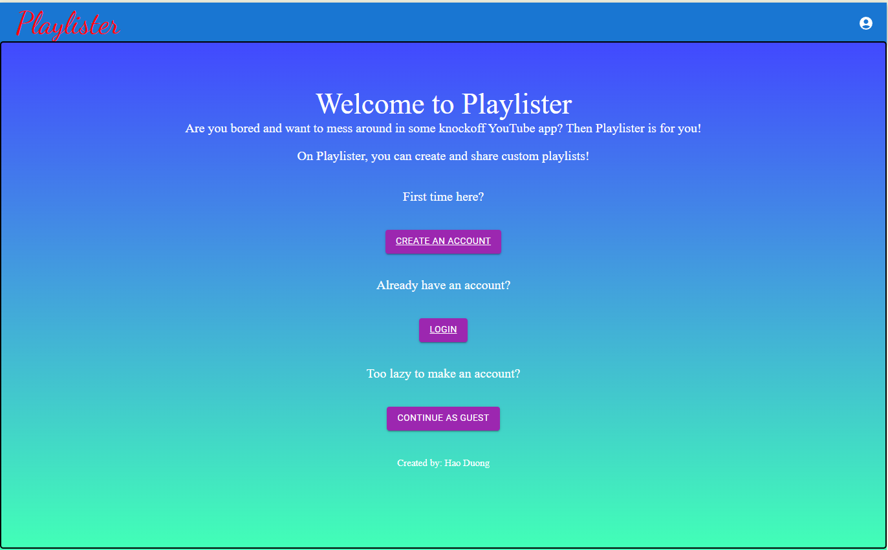
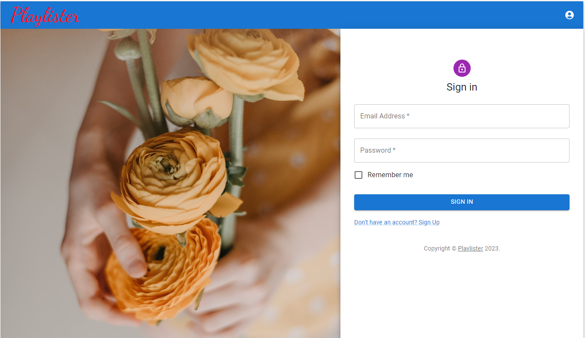
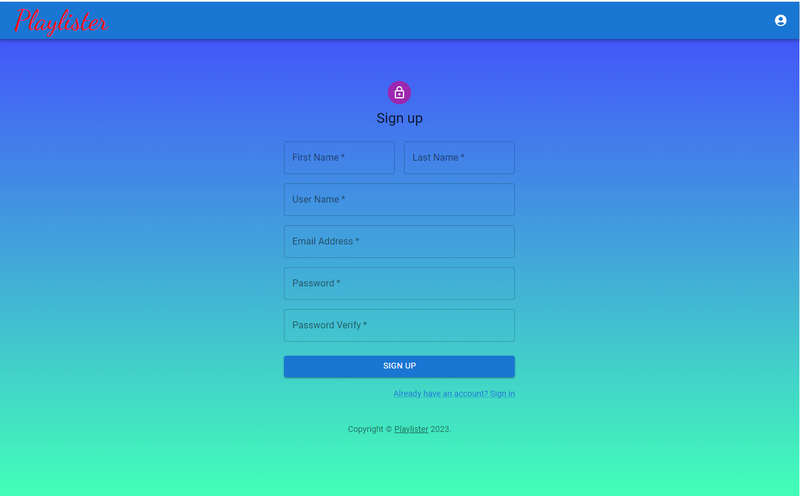
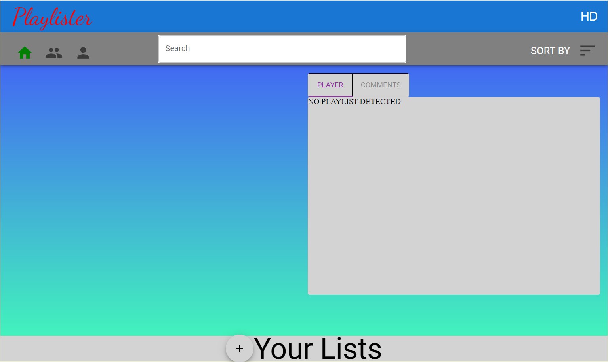
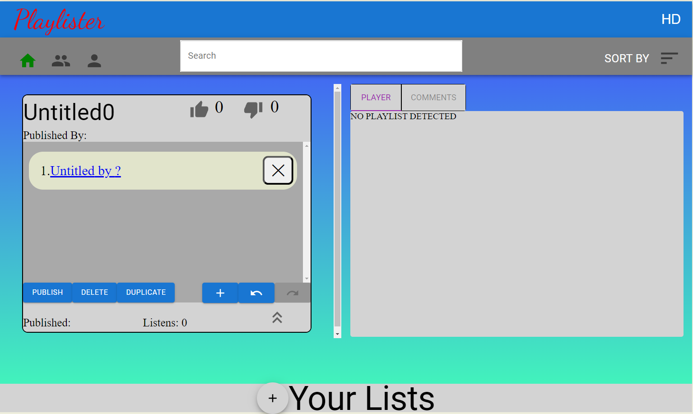
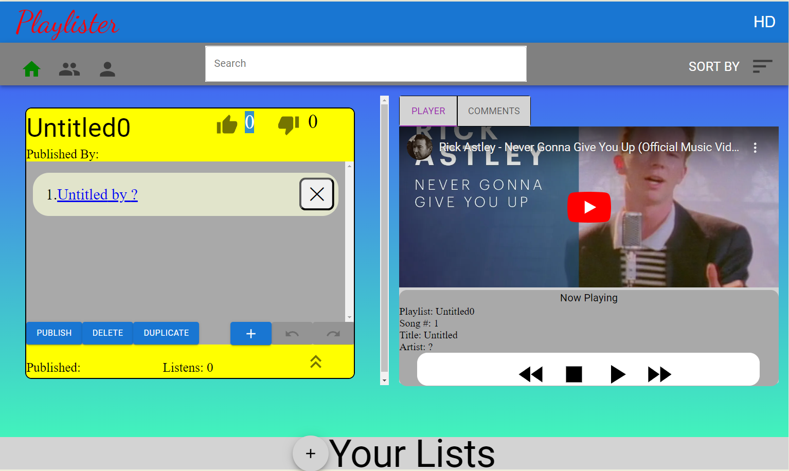
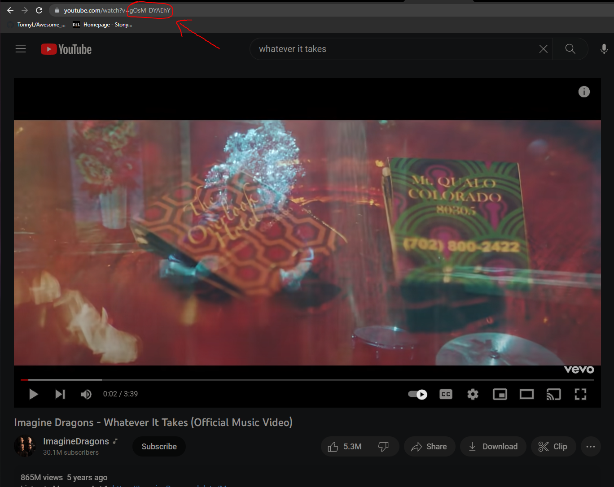
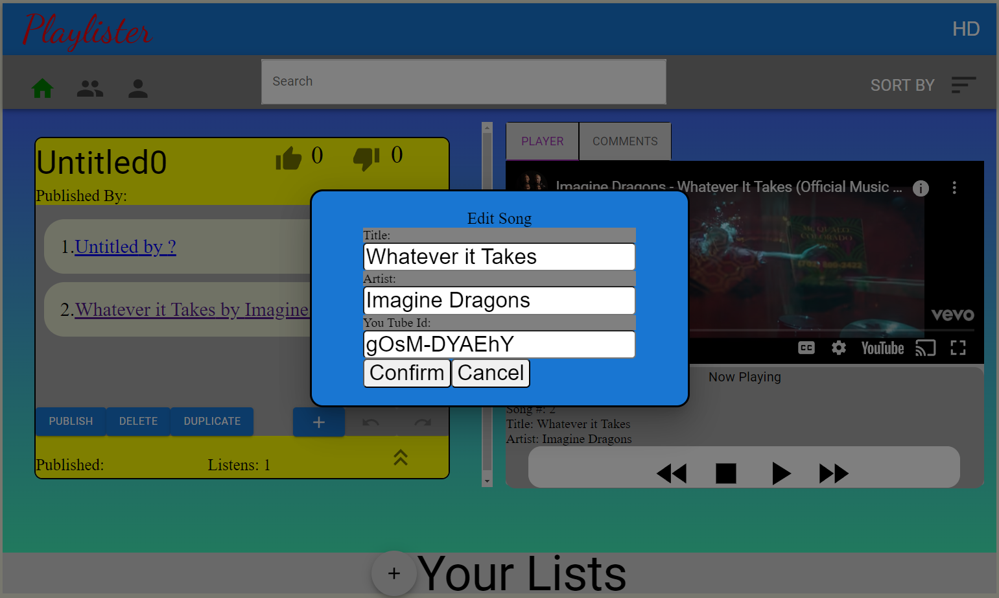
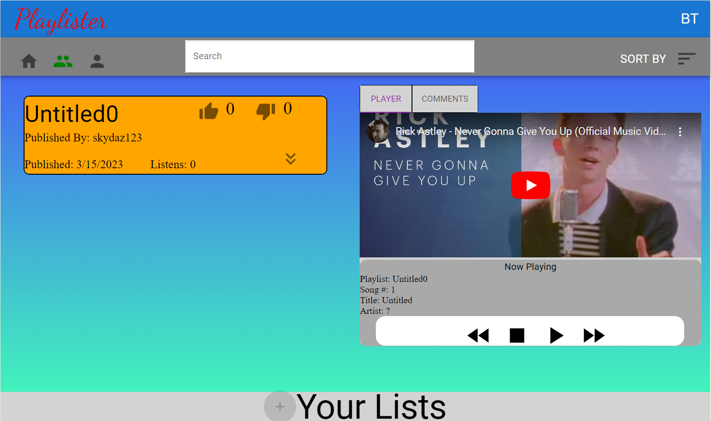
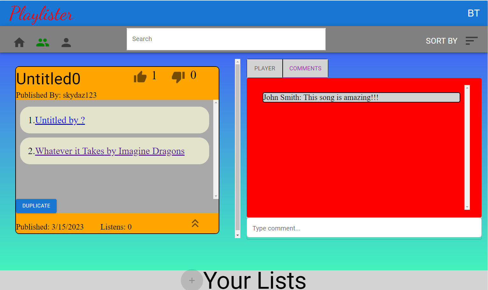

### Playlister_App

Welcome my song playlister app! Here, you can register and make playlists of songs and share it for other users to see and interact with. It also comes with an embedded YouTube player to showcased the songs!

Registering on this app is just like any other. Fill in your desired credentials and click Sign Up. Make sure to store your email address and password as reference for future logins. Note that trying to create duplicate usernames/emails are not accepted. 

We are now at the registered user homepage, where you can begin to start making your very own playlists! You will initally start with an empty dashboard. To create a playlist, go to the bottom of the page and click on the + icon 
You will also notice on the right that there is text saying NO PLAYLIST DETECTED. This is because there is no playlist selected for the embedded YouTube player to load, which will be covered shortly.

After clicking the + icon, a new playlist card will be created. To edit the title of the playlist, double-click the text of the title and type in the desired name and hit enter. To expand the playlist card, click on the double arrow button. Like the step above, click on the blue + icon to create a new song. 

To view and listen to a playlist, simply double-click anywhere on the playlist card (besides the playlist title and like/dislike buttons) and the card will turn yellow, notifying you that particular playlist has been selected. The embedded YouTube player will also appear, allowing you to listen to the contents. Just as how one would expect, the buttons at the bottom of the player directly skips/pauses/resumes/fast forwards the songs.

When creating a new song in the playlist, you will notice that each song will start with the heading "Untitled by ?" as well as Rick Roll being the default YouTube link. Before showing how to change the contents, we will need to first extract the ID of a YouTube song. To do this, navigate to the desired YouTube song and go to the top for the URL. Then, highlight all text AFTER the "=" and copy via ctrl + c to get the YouTube ID as seen in the figure below. The next step will demonstrate what to do with the said ID. 

To change the contents of a song, click once on a song card and a popup with three fields will appear (shown below).
From the previous step, clear the YouTube Id field and paste the saved URL ID via ctrl + v. After finishing modifying the desired fields, hit Confirm and the selected song will update.

Should you be happy with the playlist you curated, you can publish the playlist for other users to see by clicking on the PUBLISH icon. Instead of yellow, the selected playlist will now turn orange to indicate that it has been published. Now, other users can see the published playlist by clicking on the icon with two people left of the search bar (which will be highlighted in green instead of the house icon as shown in the figure below).  

Like the playlist someone has created? You can click on the thumbs up icon to like the playlist. You can also click on the DUPLICATE icon to save and modify a copy of your own. In addition, you can navigate to the Comments tab and leave behind a comment to express your thoughts. 

We have reached the end of the showcase of the song playlister app. This README only covers the core concept of the app, but there are many more features to explore on your own time such as sorting, searching, guest login, and more. Thank you for taking the time to check out this project!   
